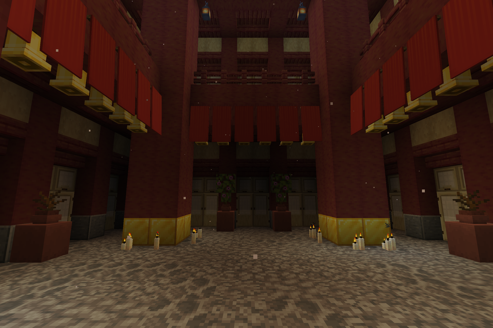

# Sef's Dimension(s)

## About



Currently, there is only dimension `sef-dim:coral_temple`. It is only accessible via commands: 

```
execute in sef-dim:coral_temple run tp USERNAME ~ ~ ~
```

## Setup

For setup instructions, please see the [Fabric Documentation page](https://docs.fabricmc.net/develop/getting-started/creating-a-project#setting-up) related to the IDE that you are using.

## License

This template is available under the CC0 license. Feel free to learn from it and incorporate it in your own projects.
